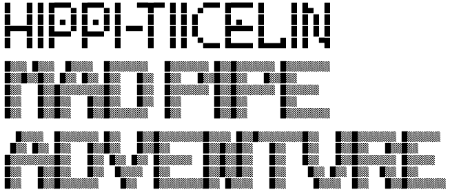
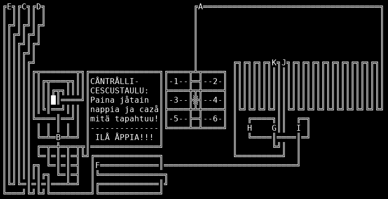

# Hippi-Tiicelin MAD PIPE ADVENTURE





## Description

A puzzle game I made in 1996 (?) when I was ~11 years old.
Follow paths in a maze and pick letters.

- QBASIC / MS-DOS
- 1514 lines
- 7 levels
- text-based graphics
- PC speaker music
- text-based title animation

The text is in obscure Finnish using lots of foreing accented Latin characters.
Hippi-Tiiceli is a character from my comic from the same time.

I had just discovered BASIC programming from Petteri Järvinen's book "Mikrotietokoneet"
(WSOY, 1986), because (a) we had a computer, and (b) I happened to read books.

## Game story (in Finnish)

```
                                   THE STORY
                              -------------------
ÅLIPA CERRAN eräz hupaiza weicko nimeltä HIPPI-TIICELI. Hän åzaa mm. väzätä
caicenlaizia wempaimia, kuten esimerkiksi tämä haramutterinwalmistuskone,
jonka hän wiimexi racensi.

Tehän kai tiedätte, että haramutteri on HÜWIN MUTCICAZ WEHJE, joka ei tee
mitään. Sen walmistukseen tarwitaan cåne, jåssa ån mahdållizimman paljon
solmussa olewia putcia. Mitä enemmän niitä putkia on ja mitä kamalammassa
järjestyxessä ne åwat, zen hienompi haramutterista tulee!
NÅ, Hippi-Tiiceli ziiz racenzi haramutterinwalmistuzcÅneen, josta olisi cai
tullut ulos muailman hienåin haramutteri, JOS SE OLISI TOIMINUT!!!

Haramutterinwalmiztuzcåneezza olewat unpicuyat wåi cårjata wain PIENENTÄMÄLLÄ
ITSENSÄ NIIN ETTÄ MAHTUU CÅNEEN ZIZÄÄN ZELWITTÄMÄÄN ZEN ÅNKELMAT!!!
Niin Hippi-Tiicelicin jÅutui tecemään. MUTTA...
Wasta cun Hippi-Tiiceli åli cåneen zyöwereissä, hän muisti, ETTEI HÄNELLÄ OLLUT
CARTTAA!
Nyt zinä joudut auttamaan Hippi-Tiiceliä zelwittämään ongelmanza ja åpastamaan
häntä haramutterinwalmistuzcåneen zockelåissa! Tehtäwäzi on waicea, mutta ze
WÅI onnistua (Jopa niinkin hywin, ettet menetä täyzin järceäzi ;-)
```
